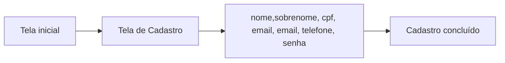
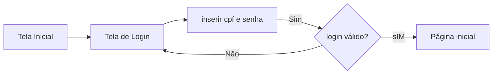
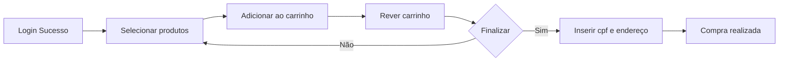
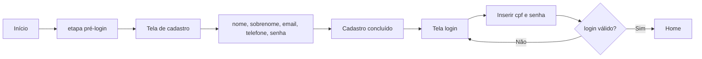
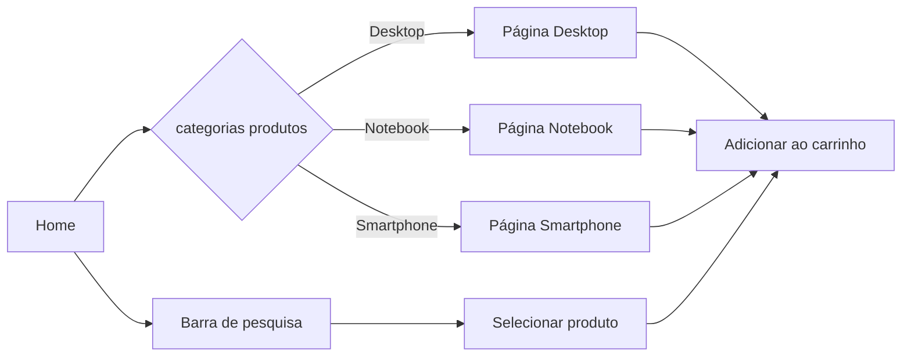

# 🛒 Documentação do Processo de Marketplace - Store Impacta

> **Nota**: Este é um projeto acadêmico desenvolvido para fins de aprendizado na faculdade. Todos os processos, links e imagens são parte de um cenário simulado e podem não refletir uma aplicação comercial real.

Bem-vindo(a) à documentação do processo de compra da [Store Impacta](https://store-imapcta.vercel.app/)! Aqui, vamos cobrir tudo o que você precisa saber para navegar no nosso sistema, desde o cadastro até a finalização da compra. 🚀

## 📑 Índice

- [Cadastro](#cadastro)
- [Login](#login)
- [Processo de Compra](#processo-de-compra)
- [Processo Geral](#processo-geral)

## 📝 Cadastro

Criar uma conta na Store Impacta é fácil e rápido! Siga os passos abaixo para começar sua jornada conosco.

### Fluxo de Cadastro

1. **Tela Inicial**: A aventura começa na tela inicial, onde você deve clicar em "Cadastro". 🌟
2. **Tela de Cadastro**: Aqui, insira suas informações básicas como nome, email e telefone. 📋
3. **Criar Senha**: Escolha uma senha forte para proteger sua conta. 🔒
4. **Conclusão**: Após preencher tudo, seu cadastro será concluído. Bem-vindo(a) à bordo! 🎉

## 🔑 Login

Já tem uma conta? Ótimo, vamos fazer login!

### Fluxo de Login

1. **Tela Inicial**: Volte à tela inicial e selecione "Login". 🏠
2. **Tela de Login**: Digite seu email e senha cadastrados. 📧🔑
3. **Validação**: Se tudo estiver correto, você será logado no sistema. Caso contrário, tente novamente. ❌✅

## 🛍️ Processo de Compra

Agora que você está logado, é hora de explorar e comprar!

### Fluxo de Compra

1. **Seleção de Produtos**: Navegue pela loja e adicione ao carrinho os produtos que desejar. 🛒
2. **Carrinho**: Revise seus produtos selecionados antes de prosseguir. 📋
3. **Finalizar Compra**: Confirme sua compra e preencha informações adicionais necessárias. 📦
4. **Pagamento**: Escolha seu método de pagamento preferido e confirme o pagamento. 💳
5. **Confirmação**: Pronto! Seu pedido foi confirmado e em breve chegará até você. 🎉

## 🔄 Processo Geral

Quer ver como tudo se conecta? Aqui está o processo do início ao fim.

### Fluxo Geral

1. **Início → Tela Inicial**: Comece na tela inicial e escolha entre fazer login ou se cadastrar. 🌈
2. **Cadastro/Login**: Complete o cadastro ou faça login para acessar a loja. 🚪
3. **Compra**: Escolha seus produtos, adicione ao carrinho, e finalize sua compra com sucesso. 🛒→💰
4. **Fim**: Aproveite seus produtos! A Store Impacta agradece sua preferência. ❤️

Esperamos que esta documentação torne sua experiência na Store Impacta ainda mais agradável e intuitiva. Se tiver dúvidas, estamos aqui para ajudar! 🌟
